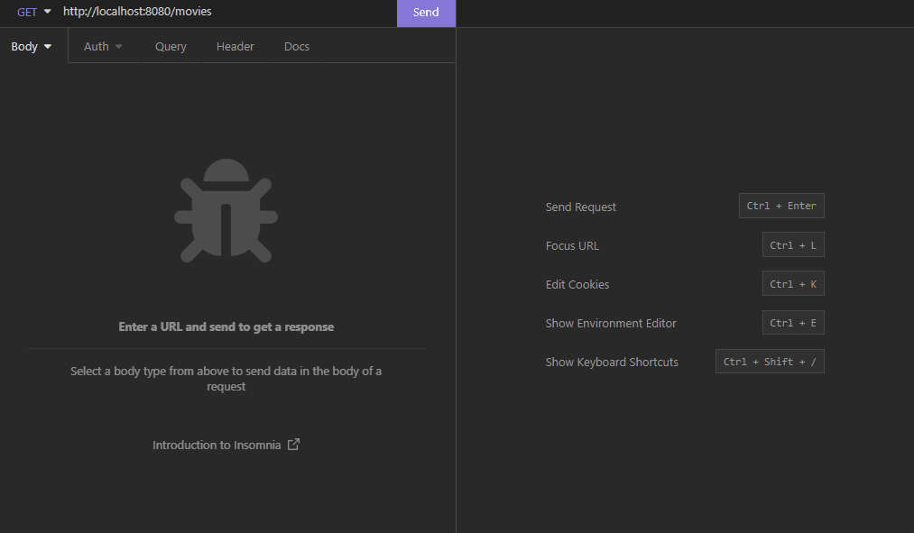
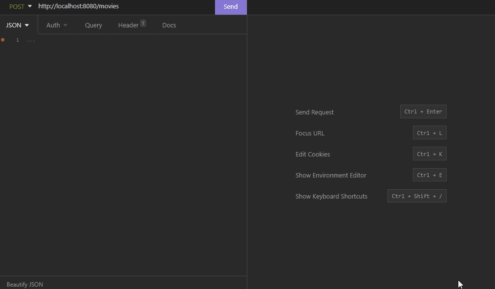
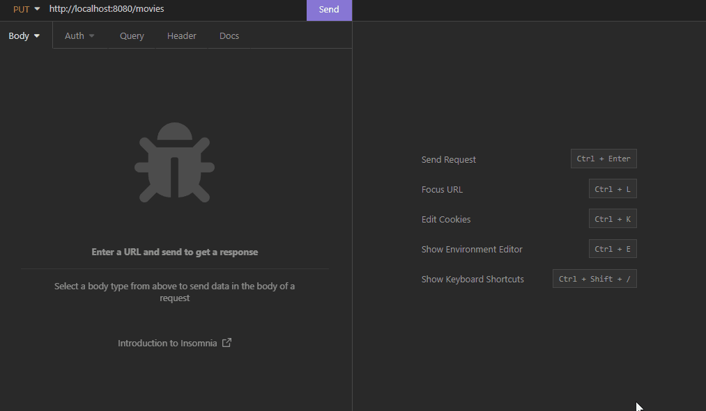
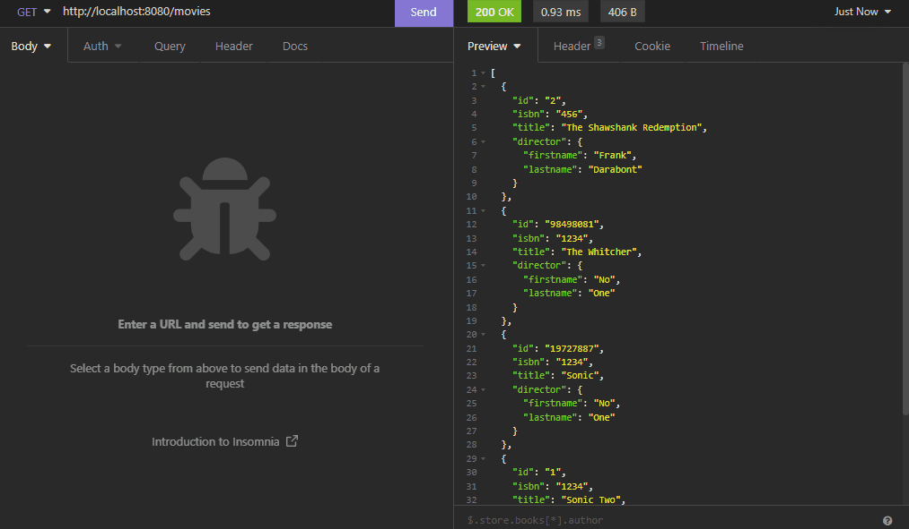

<h1 align="center">Go Movies Crud</h1>

<p align="center">
  

  

  

  

</p>

## <!-- Status -->

  <h2 align="center">Status</h2>
<h3 align="center"> 
	  🚀 Completed  ✅
</h3>

<hr>

<p align="center">
  <a href="#dart-about">About</a> &#xa0; | &#xa0; 
  <a href="#sparkles-features">Features</a> &#xa0; | &#xa0;
  <a href="#rocket-technologies">Technologies</a> &#xa0; | &#xa0;
  <a href="#white_check_mark-requirements">Requirements</a> &#xa0; | &#xa0;
  <a href="#checkered_flag-starting">Starting</a> &#xa0; | &#xa0;
  <a href="#memo-license">License</a> &#xa0; | &#xa0;
  <a href="https://github.com/harlleybastos" target="_blank">Author</a>
</p>

<br>

## :dart: About

For improve my skills with Golang I've created a CRUD of movies with simple functions.

## :sparkles: Features

:heavy_check_mark: List all current movies;\
<br>

<br>
:heavy_check_mark: Create a new movie;\
<br>

<br>
:heavy_check_mark: Get a movie by id;\
<br>

<br>
:heavy_check_mark: Update a movie by id;\
<br>

<br>
:heavy_check_mark: Delete a movie by id;
<br>

<br>

## :rocket: Technologies

The following tools were used in this project:

- [Golang](https://go.dev/)
- [Mux](https://github.com/gorilla/mux)

## :white_check_mark: Requirements

Before starting :checkered_flag:, you need to have [Git](https://git-scm.com), and [GO](https://go.dev/) installed.

## :checkered_flag: Starting

```bash
# Clone this project
$ git clone https://github.com/harlleybastos/go-movies-crud

# Access
$ cd go-movies-crud

# Install dependencies
$ go get .

# Run the project
$ go run ./main.go

# The server will initialize in the <http://localhost:8080>
```

## :memo: License

This project is under license from MIT. For more details, see the [LICENSE](LICENSE.md) file.

Made with :heart: by <a href="https://github.com/harlleybastos" target="_blank">Harlley Bastos</a>

&#xa0;

<a href="#top">Back to top</a>
